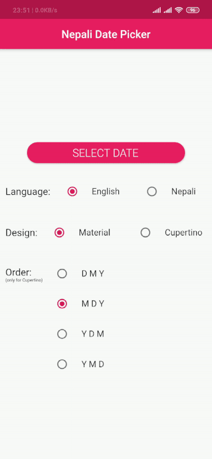

# Nepali Date Picker

[](https://pub.dev/packages/nepali_date_picker)
[](https://github.com/sarbagyastha/nepali_date_picker/blob/master/LICENSE)
[
](https://github.com/sarbagyastha/nepali_date_picker/raw/master/ndp_eg.apk)

Material and Cupertino Style Date Picker with Bikram Sambat(Nepali) Calendar Support. Supports Android, iOS and Fuchsia. Available in Nepali and English Languages.



Nepali Date Picker returns data in **NepaliDateTime** type, which is
included in [*nepali_utils*](https://pub.dev/packages/nepali_utils)
package.

### Salient Features
* Material DatePicker
* Cupertino DatePicker
* Adaptive DatePicker
* Supports from 2000 B.S. to 2099 B.S.

## Usage

#### Material Style Date Picker

```dart
import 'package:nepali_date_picker/nepali_date_picker.dart' as picker;

NepaliDateTime _selectedDateTime = await picker.showMaterialDatePicker(
    context: context,
    initialDate: NepaliDateTime.now(),
    firstDate: NepaliDateTime(2000),
    lastDate: NepaliDateTime(2090),
    language: _language,
    initialDatePickerMode: DatePickerMode.day,
);

print(_selectedDateTime); // 2076-02-16T00:00:00
```

#### Cupertino Style Date Picker
```dart
picker.showCupertinoDatePicker(
    context: context,
    initialDate: NepaliDateTime.now(),
    firstDate: NepaliDateTime(2000),
    lastDate: NepaliDateTime(2090),
    language: _language,
    dateOrder: _dateOrder,
    onDateChanged: (newDate) {
        print(_selectedDateTime);
    },
);
```

#### Adaptive Date Picker
Shows DatePicker based on Platform. 
*i.e. Cupertino DatePicker will be shown on iOS while Material on Android and Fuchsia.*
```dart
NepaliDateTime _selectedDateTime = await picker.showAdaptiveDatePicker(
    context: context,
    initialDate: NepaliDateTime.now(),
    firstDate: NepaliDateTime(2000),
    lastDate: NepaliDateTime(2090),
    language: _language,
    dateOrder: _dateOrder, // for iOS only
    initialDatePickerMode: DatePickerMode.day, // for platform except iOS
);
```

## Screenshots

***Material Design*** (Portrait)


***Material Design*** (Landscape)


***Cupertino Design***


## Example

[Detailed Example](https://github.com/sarbagyastha/nepali_date_picker/tree/master/example)


## License

```
Copyright (c) 2019 Sarbagya Dhaubanjar

Permission is hereby granted, free of charge, to any person obtaining a copy
of this software and associated documentation files (the "Software"), to deal
in the Software without restriction, including without limitation the rights
to use, copy, modify, merge, publish, distribute, sublicense, and/or sell
copies of the Software, and to permit persons to whom the Software is
furnished to do so, subject to the following conditions:

The above copyright notice and this permission notice shall be included in all
copies or substantial portions of the Software.

THE SOFTWARE IS PROVIDED "AS IS", WITHOUT WARRANTY OF ANY KIND, EXPRESS OR
IMPLIED, INCLUDING BUT NOT LIMITED TO THE WARRANTIES OF MERCHANTABILITY,
FITNESS FOR A PARTICULAR PURPOSE AND NONINFRINGEMENT. IN NO EVENT SHALL THE
AUTHORS OR COPYRIGHT HOLDERS BE LIABLE FOR ANY CLAIM, DAMAGES OR OTHER
LIABILITY, WHETHER IN AN ACTION OF CONTRACT, TORT OR OTHERWISE, ARISING FROM,
OUT OF OR IN CONNECTION WITH THE SOFTWARE OR THE USE OR OTHER DEALINGS IN THE
SOFTWARE.
```