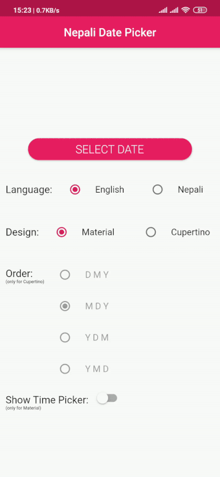
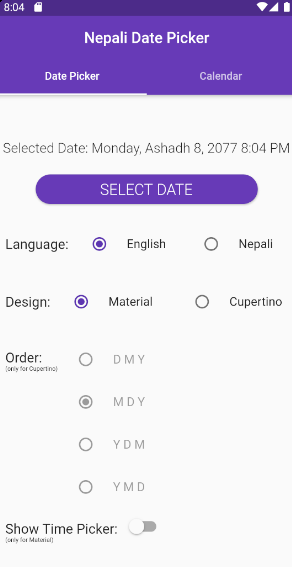
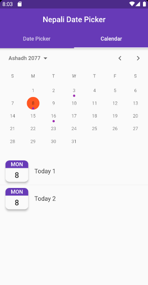
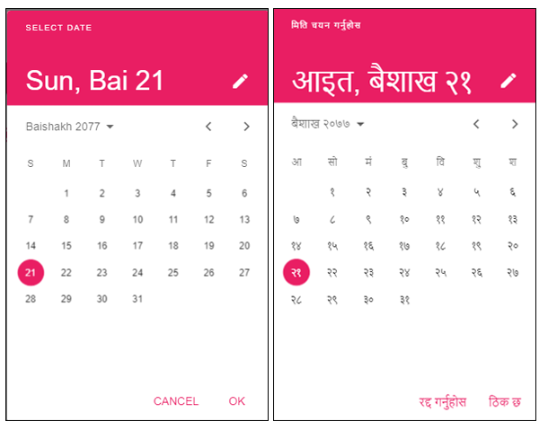
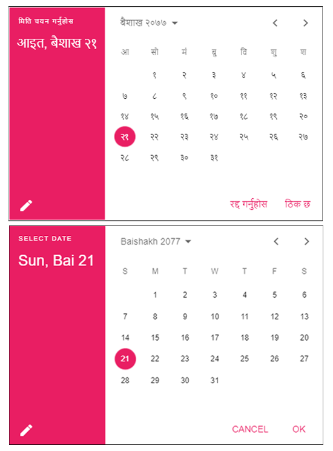
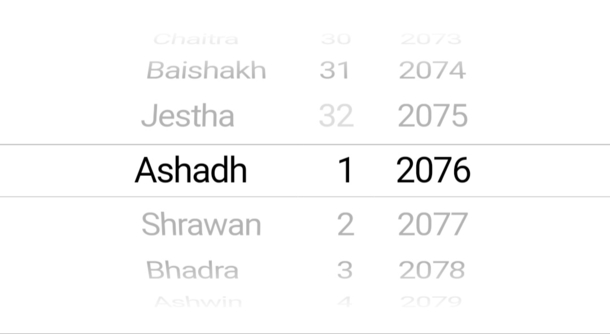
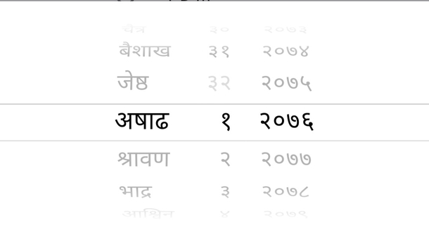

# Nepali Date Picker + Calendar

[](https://pub.dev/packages/nepali_date_picker)
[](https://github.com/sarbagyastha/nepali_date_picker/blob/master/LICENSE)
[](https://sarbagyastha.com.np/nepali_date_picker)
[](https://dart.dev/guides/language/effective-dart)

Material and Cupertino Styled Date Picker, Date Range Picker and Calendar with Bikram Sambat(Nepali) Support.



Nepali Date Picker returns data in **NepaliDateTime** type, which is
included in [*nepali_utils*](https://pub.dev/packages/nepali_utils)
package.

[**Click here to launch WEB DEMO**](https://sarbagyastha.com.np/nepali_date_picker)

 

### Salient Features
* Material DatePicker
* Cupertino DatePicker
* Adaptive DatePicker
* Calendar Picker
* Material Date Range Picker
* Calendar Range Picker
* Supports from 1970 B.S. to 2100 B.S.

## Note
Use Version 5.0.0 for `flutter < 2.1.0`

## Usage

#### Material Style Date Picker

```dart
import 'package:nepali_date_picker/nepali_date_picker.dart' as picker;

NepaliDateTime _selectedDateTime = await picker.showMaterialDatePicker(
    context: context,
    initialDate: NepaliDateTime.now(),
    firstDate: NepaliDateTime(2000),
    lastDate: NepaliDateTime(2090),
    initialDatePickerMode: DatePickerMode.day,
);

print(_selectedDateTime); // 2076-02-16T00:00:00
```

#### Cupertino Style Date Picker
```dart
picker.showCupertinoDatePicker(
    context: context,
    initialDate: NepaliDateTime.now(),
    firstDate: NepaliDateTime(2000),
    lastDate: NepaliDateTime(2090),
    language: _language,
    dateOrder: _dateOrder,
    onDateChanged: (newDate) {
        print(_selectedDateTime);
    },
);
```

#### Adaptive Date Picker
Shows DatePicker based on Platform. 
*i.e. Cupertino DatePicker will be shown on iOS while Material on Android and Fuchsia.*
```dart
NepaliDateTime _selectedDateTime = await picker.showAdaptiveDatePicker(
    context: context,
    initialDate: NepaliDateTime.now(),
    firstDate: NepaliDateTime(2000),
    lastDate: NepaliDateTime(2090),
    language: _language,
    dateOrder: _dateOrder, // for iOS only
    initialDatePickerMode: DatePickerMode.day, // for platform except iOS
);
```

#### Calender Picker
Shows Calendar, can be used for showing events.
```dart
CalendarDatePicker(
    initialDate: NepaliDateTime.now(),
    firstDate: NepaliDateTime(2070),
    lastDate: NepaliDateTime(2090),
    onDateChanged: (date) => _selectedDate.value = date,
    dayBuilder: (dayToBuild) { // Optional
      return Center(
                child: Text(
                    '${dayToBuild.day}',
                    style: Theme.of(context).textTheme.caption,
               ),
          ),
      },
     selectedDayDecoration: BoxDecoration ( // Optional
            color: Colors.deepOrange,
            shape: BoxShape.circle,
     ),
     todayDecoration: BoxDecoration ( // Optional
            gradient: LinearGradient(colors: [Colors.yellow, Colors.orange]),
            shape: BoxShape.circle,
     ),
};
```

## Screenshots

***Material Design*** (Portrait)



***Material Design*** (Landscape)



***Cupertino Design***





## Example

[Detailed Example](https://github.com/sarbagyastha/nepali_date_picker/tree/master/example)


## License

```
Copyright 2020 Sarbagya Dhaubanjar. All rights reserved.

Redistribution and use in source and binary forms, with or without modification,
are permitted provided that the following conditions are met:

    * Redistributions of source code must retain the above copyright
      notice, this list of conditions and the following disclaimer.
    * Redistributions in binary form must reproduce the above
      copyright notice, this list of conditions and the following
      disclaimer in the documentation and/or other materials provided
      with the distribution.
    * Neither the name of Google Inc. nor the names of its
      contributors may be used to endorse or promote products derived
      from this software without specific prior written permission.

THIS SOFTWARE IS PROVIDED BY THE COPYRIGHT HOLDERS AND CONTRIBUTORS "AS IS" AND
ANY EXPRESS OR IMPLIED WARRANTIES, INCLUDING, BUT NOT LIMITED TO, THE IMPLIED
WARRANTIES OF MERCHANTABILITY AND FITNESS FOR A PARTICULAR PURPOSE ARE
DISCLAIMED. IN NO EVENT SHALL THE COPYRIGHT OWNER OR CONTRIBUTORS BE LIABLE FOR
ANY DIRECT, INDIRECT, INCIDENTAL, SPECIAL, EXEMPLARY, OR CONSEQUENTIAL DAMAGES
(INCLUDING, BUT NOT LIMITED TO, PROCUREMENT OF SUBSTITUTE GOODS OR SERVICES;
LOSS OF USE, DATA, OR PROFITS; OR BUSINESS INTERRUPTION) HOWEVER CAUSED AND ON
ANY THEORY OF LIABILITY, WHETHER IN CONTRACT, STRICT LIABILITY, OR TORT
(INCLUDING NEGLIGENCE OR OTHERWISE) ARISING IN ANY WAY OUT OF THE USE OF THIS
SOFTWARE, EVEN IF ADVISED OF THE POSSIBILITY OF SUCH DAMAGE.
```