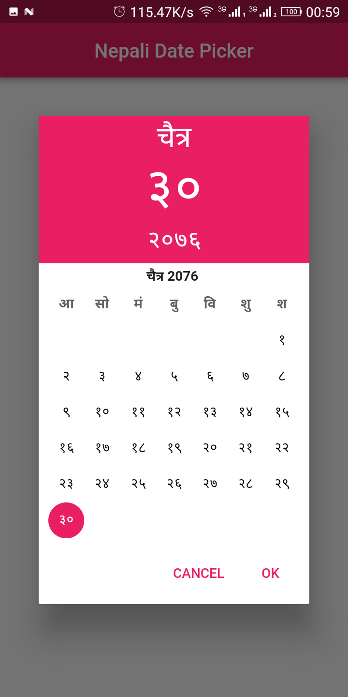

# Nepali Date Picker

[[pub packages]](https://pub.dartlang.org/packages/nepali_date_picker)

Bikram Sambat(B.S.) Date Picker.


## Usage

#### 1\. Depend

Add this to you package's `pubspec.yaml` file:

```yaml
dependencies:
  nepali_date_picker: ^1.0.0
```

#### 2\. Install

Run command:

```bash
$ flutter packages get
```

#### 3\. Import

Import in Dart code:

```dart
import 'package:nepali_date_picker/nepali_date_picker.dart';
```

#### 4\. Display Nepali DatePicker

```dart
///
/// context: BuildContext.
/// startYear: Min value of year's selection range.
/// endYear: Max value of year's selection range.
/// color: Accent Color.
/// barrierDismissible: Defines if Date Picker Dialog is dismissible through barriers. Default is false.
/// language: Language.NEPALI or Language.ENGLISH.  Default is Language.ENGLISH.
/// onPicked: Callback when "OK" action is pressed. Callback type is DateTime.
///
NepaliDatePicker.showPicker(
     context: context,
     startYear: 2052,
     endYear: 2085,
     color: Colors.pink,
     barrierDismissible: false,
     language: Language.NEPALI,
     onPicked: (DateTime date) {
         setState(() {
            ///Iso8601String Format: 2018-12-23T00:00:00
            String _pickedDate = date.toIso8601String().split("T").first;
         });
     },
);
```

***In Nepali Language***



## Example

[Example sources](https://github.com/sarbagyastha/nepali-date-picker/tree/master/example)


## License

```
Copyright 2018 Sarbagya Dhaubanjar

Licensed under the Apache License, Version 2.0 (the "License");
you may not use this file except in compliance with the License.
You may obtain a copy of the License at

   http://www.apache.org/licenses/LICENSE-2.0

Unless required by applicable law or agreed to in writing, software
distributed under the License is distributed on an "AS IS" BASIS,
WITHOUT WARRANTIES OR CONDITIONS OF ANY KIND, either express or implied.
See the License for the specific language governing permissions and
limitations under the License.
```